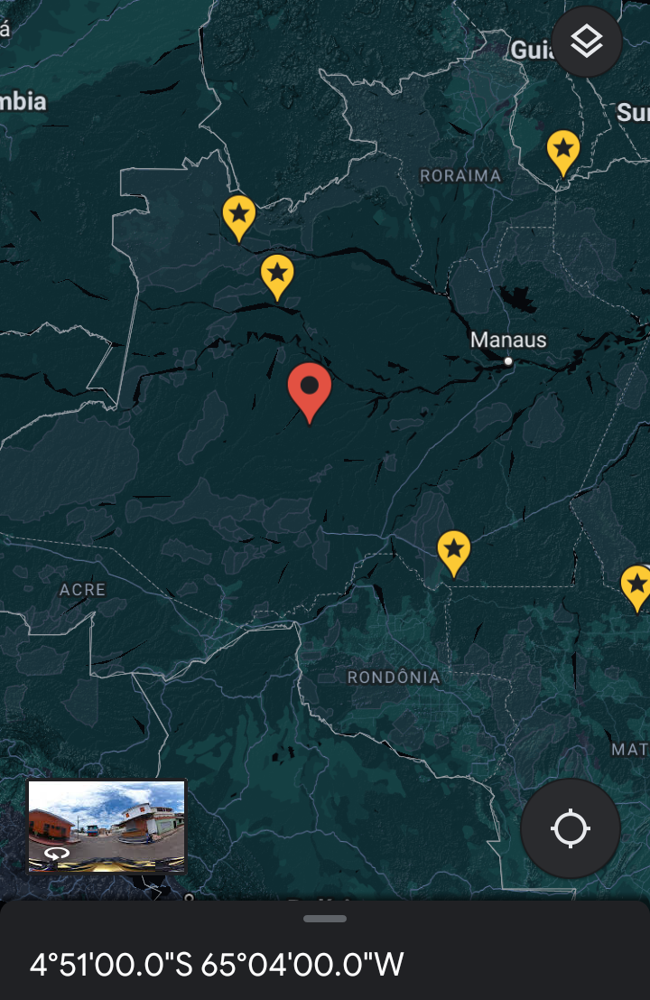
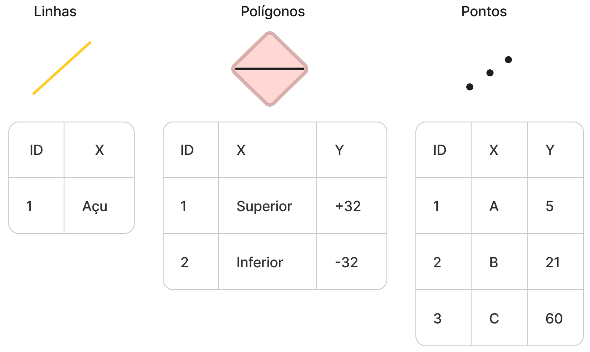
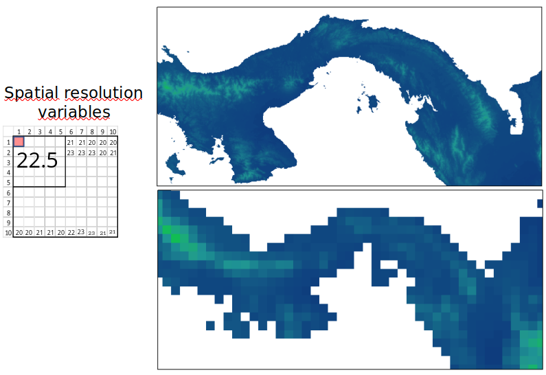

class: title-slide, left, middle
background-image: url("images/GE.png")
background-position: 85% 50%
background-size: 30%
background-color: #F9F8F3

.pull-left[

# `r rmarkdown::metadata$title`

### `r rmarkdown::metadata$author`

### `r rmarkdown::metadata$org`

### `r rmarkdown::metadata$date`
]

???

Olá me chamo Tainá, sou bióloga de formação, fiz um mestrado em biologia ambiental pela UFPA e doutorado em zoologia pelo Museu Emílio Goeldi. Atualmente sou pesquisadora, eu atuo no lab de universidade estadual da Florida. E também  sou consultora do Centro Nacional de Conservação da Flora Brasil do Jardim Botânico do RJ.
E resumidamente eu faço pesquisas com foco em biodiversidade e mudanças globais (principalmente mudanças climáticas). E uma ferramenta que tenho explorado é o rgee (um pacote em R para acessa o plataforma Earth Engine). Então a ideia é compartilhar com vocês essa experiência.  

---
class: middle, center

# Roteiro
<br>

.pull-left[


]

.pull-right[
<br>
<center> O que são e quais tipos de geoespaciais </center> 
<br>
<center>  Principais pacotes para manipualações deste tipo de dado </center>
<br>
<center>  Bases de dados </center>
<br>
<center> Estudos de casos (No Rstudio)</center>

]
???

Então vou começar falando...
---
## O que são dados geoespaciais ?

.pull-left[
```{r geodata, echo=FALSE, out.width="50%", fig.align="center"}

```
]

.pull-center[
<br>
<br>
O que define um dado espacial é presença do componente espacial, ou seja, informações geográficas; georreferencias de determinando local no globo.
]
---
## Tipos de dados geoespaciais 
#### Dados vetoriais

Formas geométricas (ex. pontos, linhas e polígonos) com tabelas de atributos associadas. 
.pull-center[
```{r vetor, echo=FALSE, out.width="50%", fig.align="center"}

```
]
.pull-right[
<br>
<br>
<br>
<br>

]
---
#### Dados matriciais. Conjunto de células/pixels (matriz). 
.pull-center[
```{r rasterM, echo=FALSE, out.width="70%", fig.align="center"}

```

]

<br>
<br>
<br>
<br>
<br>
<br>
<br>
---
#### Pacotes de manipulação 
.pull-left[
[sf](https://r-spatial.github.io/sf/): simmple feature é o pacote mais popular para codificação de dados espaciais

[stars](https://github.com/r-spatial/stars): Leitura, manipulação, escrita e plotagem de arrays espaço-temporais (raster e cubos de dados vetoriais) em 'R', usando ligações 'GDAL' fornecidas por 'sf' e ligações 'NetCDF' por 'ncmeta' e 'RNetCDF'.

[shapefiles](https://cran.r-project.org/web/packages/shapefiles/index.html): funções para ler e escrever ESRI Shapefiles

[rgeos](https://cran.r-project.org/web/packages/rgeos/index.html): Manipulação e consulta de geometrias espaciais usando o mecanismo de geometria GEOS

[rgdal](https://cran.r-project.org/web/packages/rgdal/index.html): fornece ligações para a Geospatial Data Abstraction Library (GDAL)

[maptools](https://cran.r-project.org/web/packages/maptools/index.html): é um conjunto popular de ferramentas para manipulação de dados geográficos


]

.pull-right[
[raster](https://cran.r-project.org/web/packages/raster/index.html): para trabalhar com dados matriciais(raster). 

[rgee](https://r-spatial.github.io/rgee/reference/rgee-package.html): pacote para acesso ao Google Earth Engine via R

[terra](https://cran.r-project.org/web/packages/terra/index.html): Métodos para análise de dados espaciais com dados vetoriais e matriciais (rater)

[ncdf4](https://cran.r-project.org/web/packages/ncdf4/index.html): manipulação de dados armazedados em formato NetCDF
]
---
#### Pacotes de vizualização 
.pull-left[
[ggplot2](https://ggplot2.tidyverse.org/): Criar gráficos e mapas usando a "gramática dos gráficos"

[ggspatial](https://cran.r-project.org/web/packages/ggmap/index.html): interação com do ggplot2 focado em dados geoespaciais.

[ggmap](https://cran.r-project.org/web/packages/ggmap/index.html): braço do ggplot2 com acesso ao Google Maps (OpenStreetMap).

[RColorBrewer](https://cran.r-project.org/web/packages/RColorBrewer/index.html): Usar esquemas de cores criados por Cynthia Brewer

[tmap](https://cran.r-project.org/web/packages/tmap/vignettes/tmap-getstarted.html): Mapeamento temático usando a sintaxe "gramática de gráficos"
]

.pull-right[
[leaflet](https://rstudio.github.io/leaflet/): Criação de mapas web interativos usando o Leaflet

[mapview](https://r-spatial.github.io/mapview/): Criação de visualizações espaciais interativas com janelas pop-up para dados de atributos

[cartografia](https://cran.r-project.org/web/packages/cartography/index.html): Criação de representações cartográficas com elementos típicos do mapa

[coroplethr](https://cran.r-project.org/web/packages/choroplethr/index.html): simplifica a produção de mapas coropléticos

[viridis](https://cran.r-project.org/web/packages/viridis/vignettes/intro-to-viridis.html): Paletas de cores
]
---
#### Pacotes bases de dados 
.pull-left[
[geobr](https://github.com/ipeaGIT/geobr#readme):	Carrega Shapefiles de Conjuntos de Dados Espaciais Oficiais do Brasil

[rnaturalearth](https://github.com/ropensci/rnaturalearth):	Dados do mapa mundial da Natural Earth

[geodata](https://github.com/rspatial/geodata)	Diversas bases de dados para o mundo

[rworldmap](https://cran.r-project.org/web/packages/rworldmap/index.html): Visualização de dados globais

[spData](https://jakubnowosad.com/spData/):	Conjuntos de dados para análise espacial

]

.pull-right[
[osmdata](https://github.com/ropensci/osmdata)	Baixa e importa dados do OpenStreetMap

[geonames](https://cran.r-project.org/web/packages/geonames/index.html):	Interface para o serviço da Web de consulta espacial ‘Geonames’

[rgbif](https://www.gbif.org/tool/81747/rgbif):	Interface para o Global ‘Biodiversity’ Information Facility API

[maptools](https://uribo.github.io/rpkg_showcase/spatial/maptools.html):	Ferramentas para lidar com objetos geoespaciais

[marmap](https://cran.r-project.org/web/packages/marmap/index.html): Importar, traçar e analisar dados batimétricos e topográficos

[oce](https://dankelley.github.io/oce/):	Fonte e processamento de dados oceanográficos
]

---
#### Pacotes bases de dados 

[OpenStreetMap](https://cran.r-project.org/web/packages/OpenStreetMap/index.html):	Acesso para abrir imagens raster de mapas de ruas

[envirem](https://envirem.github.io/):	Geração de variáveis ENVIREM

[sdmpredictors](https://github.com/lifewatch/sdmpredictors):	Conjuntos de dados preditor de modelagem de distribuição de espécies

[ClimDown]():	Biblioteca de redução de escala do clima para a produção diária do modelo climático

[rnoaa](https://github.com/ropensci/rnoaa): Dados meteorológicos ‘NOAA’ de R

[RNCEP](https://cran.r-project.org/web/packages/RNCEP/index.html): Obtém, organiza e visualiza dados meteorológicos NCEP

[smapr](https://github.com/ropensci/smapr): Aquisição e processamento de dados ativos-passivos (SMAP) de umidade do solo da NASA
---
#### Bases de dados vatorias
.pull-left[
[IBGE](https://www.ibge.gov.br/geociencias/downloads-geociencias.html): Limites territoriais e censitários do Brasil

[FBDS](http://geo.fbds.org.br/): Uso da terra, APP e hidrografia - Mata Atlântica e Cerrado

[GeoBank](https://geosgb.cprm.gov.br/):	Dados geológicos do Brasil

[Pastagem.org](https://atlasdaspastagens.ufg.br/):	Dados de pastagens e gado para o Brasil

[CanaSat](http://www.dsr.inpe.br/laf/canasat/): Dados de cana-de-açúcar para o Brasil

]

.pull-right[
[CSR Maps](https://maps.csr.ufmg.br/):	Diversos dados vetoriais e raster para o Brasil

[Ecoregions](https://ecoregions.appspot.com/):	Dados de biorregiões e biomas do mundo

[UN Biodiversity Lab](https://unbiodiversitylab.org/en/):	Diversas bases de dados para o mundo

[Biodiversity Hotspots](https://zenodo.org/record/3261807#.YA8lpPv0nOY): Limites dos Hotspots de Biodiversidade

[IUCN Red List of Threatened Species](https://www.iucnredlist.org/resources/spatial-data-download): Limites das distribuições das espécies para o mundo
]

---
#### Bases de dados vetoriais
.pull-left[
[Map of Life (MOL)](https://mol.org/):	Dados da distribuição de espécies e outros dados para o mundo

[Key Biodiversity Areas](https://www.keybiodiversityareas.org/kba-data/request):	Dados dos limites das Key Biodiversity Areas

[HydroSHEDS](https://www.hydrosheds.org/):	Informações hidrológicas do mundo

[Global Roads Inventory Project (GRIP)](https://www.globio.info/download-grip-dataset):	Dados de estradas do mundo

]

.pull-right[

[Database of Global Administrative Areas (GADM)](https://gadm.org/):	Limites das áreas administrativas do mundo

[Natural Earth](https://www.naturalearthdata.com/):	Diversos limites para o mundo

[Protected Planet](https://www.protectedplanet.net/en):	Limites de áreas protegidas para o mundo

[Global Biological Information Facility (GBIF)](https://www.gbif.org/):	Dados de ocorrências de espécies para o mundo

]
---
#### Bases de dados vetoriais

[Species Link](http://www.splink.cria.org.br/):	Dados de ocorrências de espécies para o Brasil

[Global Invasive Species Information Network (GISIN)](http://www.gisin.org/):	Dados de ocorrências de espécies invasoras para o Mundo

---
#### Bases de dados  matriciais

.pull-left[

[MapBiomas](https://mapbiomas.org/):	Uso e cobertura da terra para o Brasil (1985 a 2021)

[USGS](https://www.usgs.gov/products/data):	Dados de diversos satélites livres para o mundo

[SRTM](https://srtm.csi.cgiar.org/):	Dados de elevação para o mundo

[Geoservice Maps](https://geoservice.dlr.de/web/maps):	Dados de elevação e florestas para o mundo

[Global Forest Watch](https://www.globalforestwatch.org/): Dados de florestas para o mundo
]

.pull-right[

[GlobCover](http://due.esrin.esa.int/page_globcover.php): Dados de uso e cobertura da terra para todo o planeta

[Landcover](https://www.earthenv.org/landcover)	Dados de uso e cobertura da terra para todo o planeta

[Global Human Footprint](https://wcshumanfootprint.org/):	Dados de pegada ecológica para o mundo

[GHSL Global Human Settlement Layer](https://ghsl.jrc.ec.europa.eu/download.php):	Dados e ferramentas abertos e gratuitos para avaliar a presença humana no planeta
]
---
#### Bases de dados matriciais
.pull-left[
[Land-Use Harmonization (LUH2)](https://luh.umd.edu/data.shtml):	Dados atuais e previsões de uso da terra

[EarthEnv](https://www.earthenv.org/):	Dados de cobertura da terra, nuvens, relevo e hidrografia

[ESA Climate Change Initiative](https://climate.esa.int/en/odp/#/dashboard):	Arquivos globais de observação da Terra nos últimos 30 anos da Agência Espacial Europeia (ESA)

[SoilGrids](https://soilgrids.org/):	Dados de solo para o mundo

]

.pull-right[
[Global Wetlands](https://www2.cifor.org/global-wetlands/):	Dados de áreas úmidas para o mundo

[Global Surface Water Explorer](https://global-surface-water.appspot.com/#):	Dados de águas superficiais para o mundo

[MARSPEC](http://www.marspec.org/): Dados de condições do oceano para o mundo

[Bio-ORACLE](https://www.bio-oracle.org/): Dados de condições do oceano para o mundo
]
---
#### Bases de dados matriciais

[WorldClim](https://www.worldclim.org/): Dados climáticos para o mundo

[CHELSA](https://chelsa-climate.org/): Dados climáticos para o mundo

[PaleoClim](http://www.paleoclim.org/): Dados paleoclimáticos de alta resolução para uso em modelagem biológica e SIG

---
#### Estudos de caso

#### Exemplos práticos, código disponível no [Github](https://github.com/Tai-Rocha/VII_SER/blob/main/R/VII%20SER.R) 
.pull-center[
<iframe src="https://giphy.com/embed/3o85xsrY5PHwMjtKz6" width="550" height="300" frameBorder="0" class="giphy-embed" allowFullScreen></iframe><p><a href="https://giphy.com/gifs/vulture-3o85xsrY5PHwMjtKz6"></a></p>
]
---
#### Referências

- [Geocomputation with R](https://geocompr.robinlovelace.net/)

- [Análises Ecológicas no R](https://analises-ecologicas.netlify.app/index.html)

- [Ciência de Dados em R](https://livro.curso-r.com/index.html)

- [Análise Espacial com R](https://www.dropbox.com/s/blgtp2bmpdghol7/AnaliseEspacialComR.pdf?dl=0)


---
name: hello
class: middle, center, inverse


### `r rmarkdown::metadata$author`


### `r rmarkdown::metadata$role`

### `r rmarkdown::metadata$org`

[`r fontawesome::fa("github")` @Tai-Rocha](https://github.com/Tai-Rocha)    
[`r fontawesome::fa("twitter")` @Tai_Rocha_](https://twitter.com/Tai_Rocha_)   
[`r fontawesome::fa("link")` tairocha.netlify.app](https://tairocha.netlify.app/)


